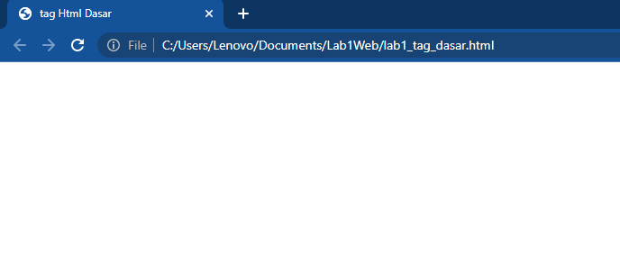
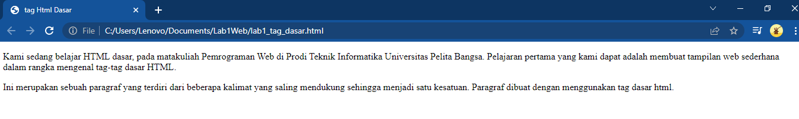
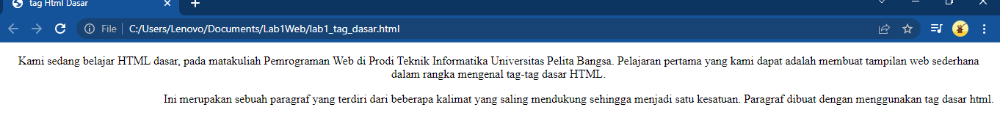
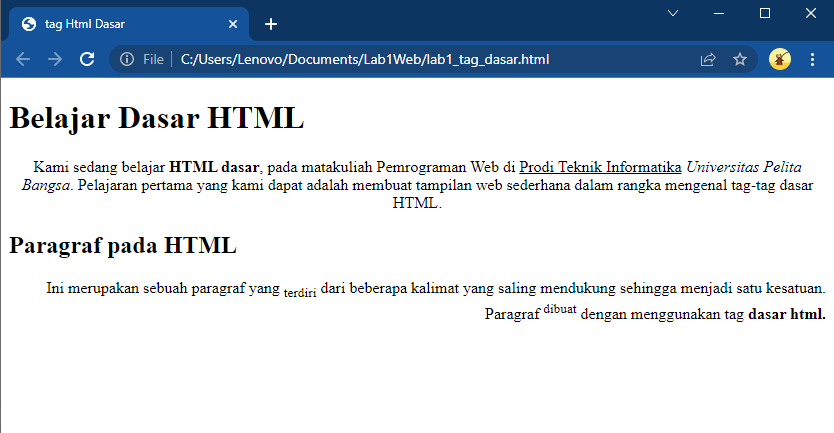
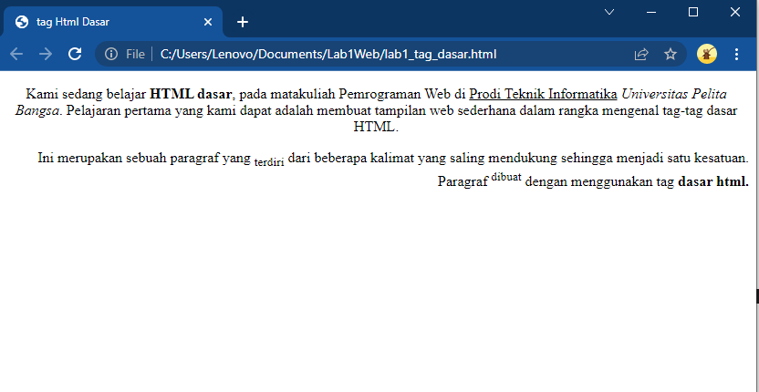
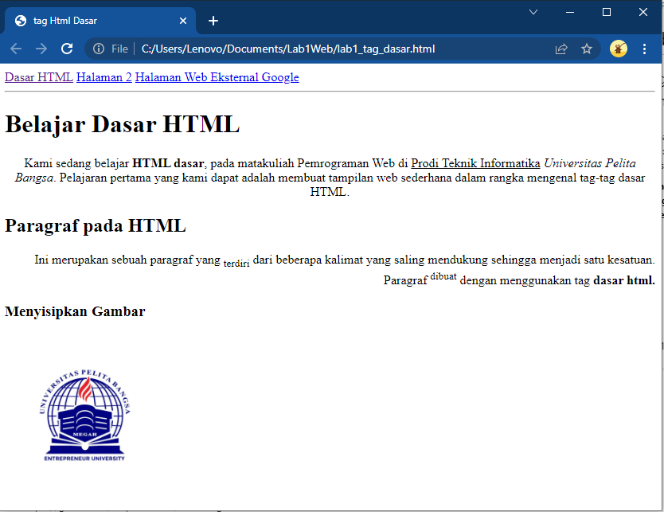

# Lab1Web
##  Tugas pertemuan 2 pemegroman Web

 

Nama : Ade prasetia  
Nim : 312010208  
Kelas : TI.20.B1    

**Pada pertemuan 2 mata kuliah Pemgrograman Web, saya akan melakukan beberapa pada HTML**

- Menampilkan Title HTML pada browser  

 

1. **Membuat paragraf**

  

pada poin ini akan membuat paragraf padafileHTML. 
pada sintak p bertujuan untuk membuat paragraf baru. Berikut tampilanya.  

1. **Membuat Paragraf**
Pada poin ini saya akan membuat paragraf pafa file HTML. Pada sintax p bertujuan untuk membuat baru, Berikut tampilanya

- **Perataan Paragraf**

Disini saya akan merubah perataan pada paragraf yang sudah tersedia, yaitu paragraf pertama menjadi rata tengah, paragraf kedua rata kanan. Berikut tampilanya.

 

2. **meberi judul**

Saya akan memberi judul pada teks tersebut

 

3. **format teks**

Disini saya akan mengubah teks menjadi tebal dan miring
 

4. **gambar**

Saya akan menambahkan logo upb
 

5. **Hyperlink**

Saya akan membagikan hyper link yang akan mengalihkan ke halaman lain
 

