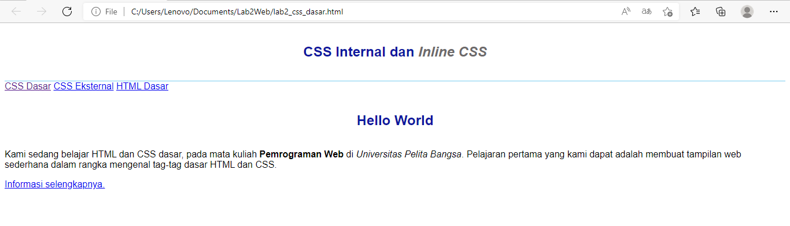
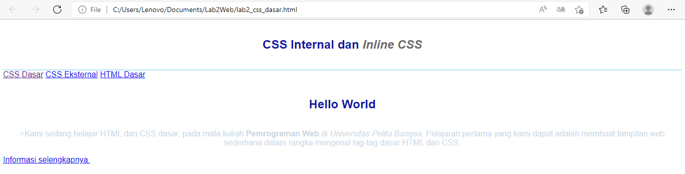
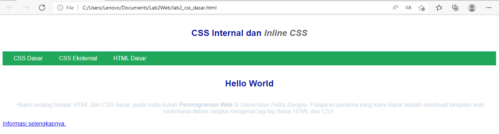
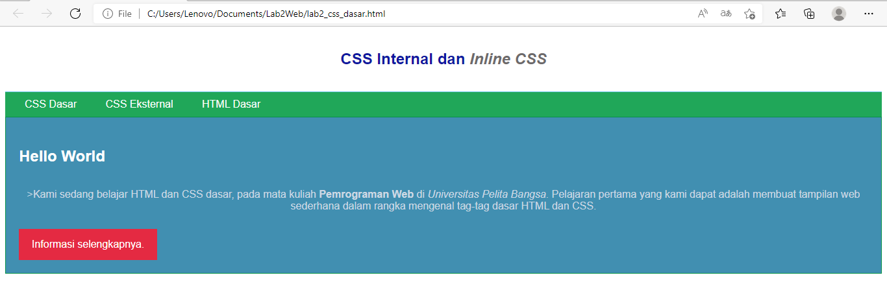

# Lab2Web

Nama : Ade prasetia

kls  : TI 20 B1

NIM  : 312010208

Intruksi Praktikum 

1. Membuat file HTML

2. Mendeklarasikan CSS Internal

3. Menambahkan Inline CSS

4. Membuat CSS Eksternal

5. Menambahkan CSS Selector

