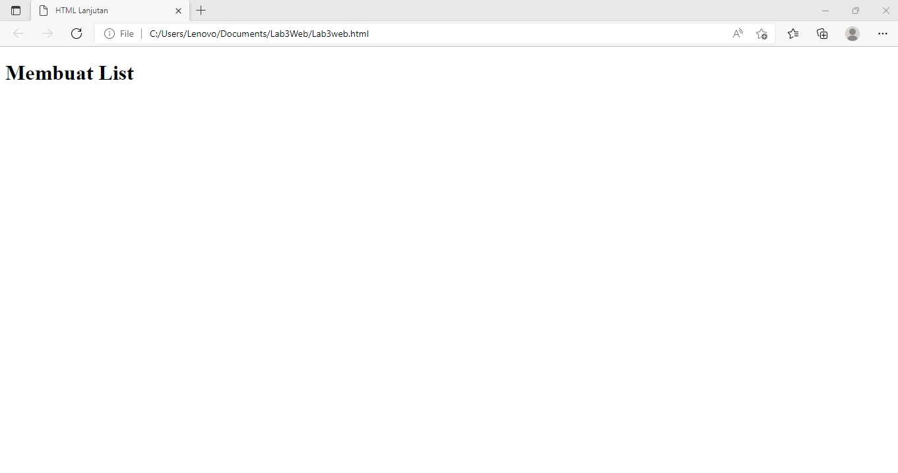
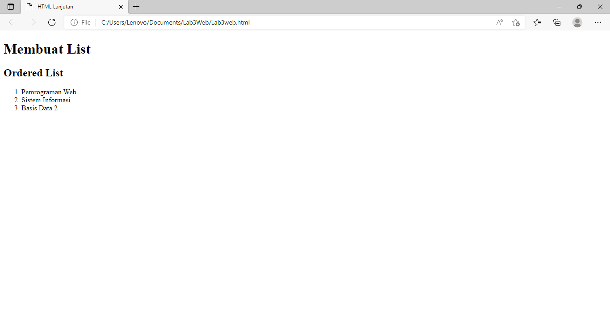
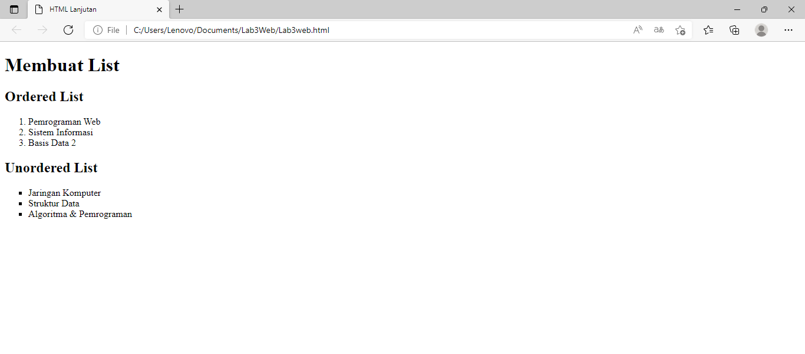
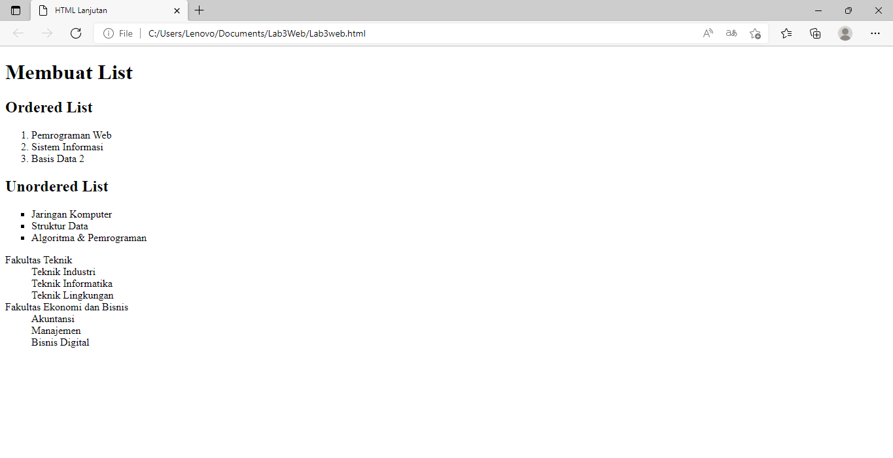
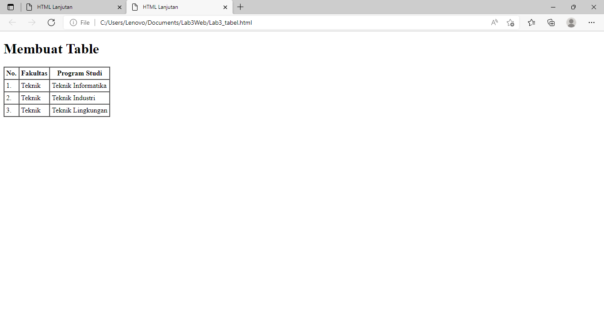
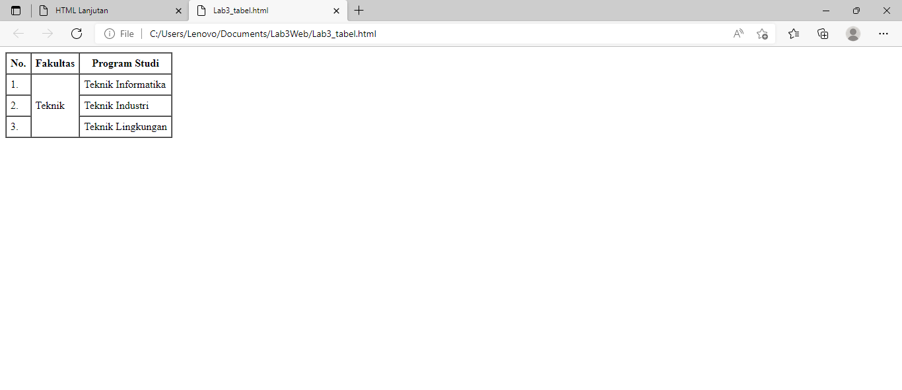
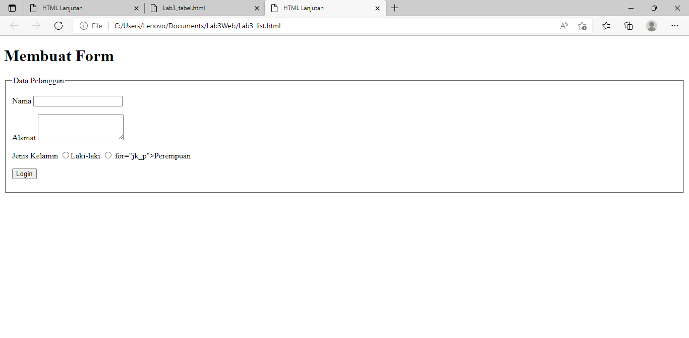
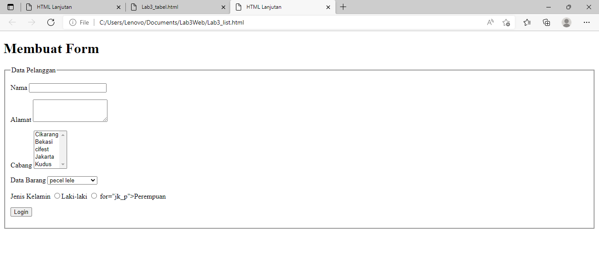

Tugas praktikum

**NAMA : Ade prasetia** 
**KELAS : TI 20 B1** 
**NIM  : 312010208** 

1.**Membuar List HTML**

Pada pertemuan kali ini saya akan membuat list tabel

2.**order list**

Langkah ke dua kita masukan order list

3.**Membuat Unorderd List**

Langkah ke tiga kita tambahkan unorderd list

4. **Membuat Description List**

Langkah ke empat kita tambahkan  kode untuk membuat description list setelah deklarasi unorderd-list.

* **Membuat Tabel**
Selanjutnya lakukan eksperimen lain terkait list dan penggunaan atribut type pada list. Membuat Tabel Buat file baru dengan nama lab3_tabel.htmlseperti berikut.

* **menggabungkan sel data** 
Untuk menggabungkan sel data, gunakan atribut rowspan dan colspan. Atribut rowspan untuk
menggabungkan baris (secara vertikal) dan colspan untuk menggabungkan kolom (secara
horizontal)

5. **Membuat Form**

Buat file baru dengan nama lab3_form.html seperti berikut.

* **jawaban**
Buatlah form yang menampilkan dropdown menu dan listbox dengan multiple selection.

