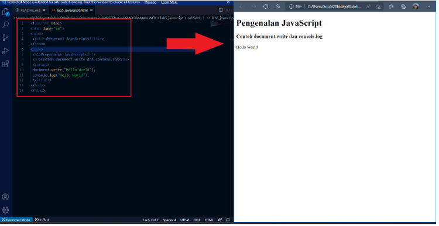
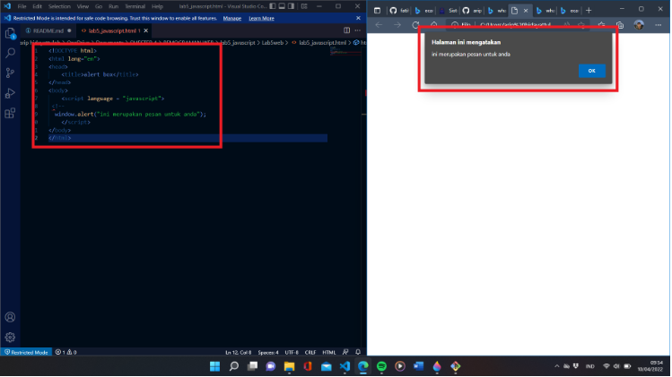
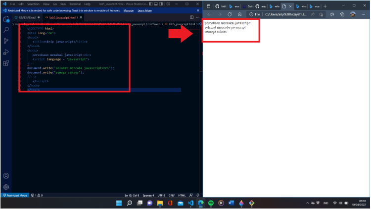
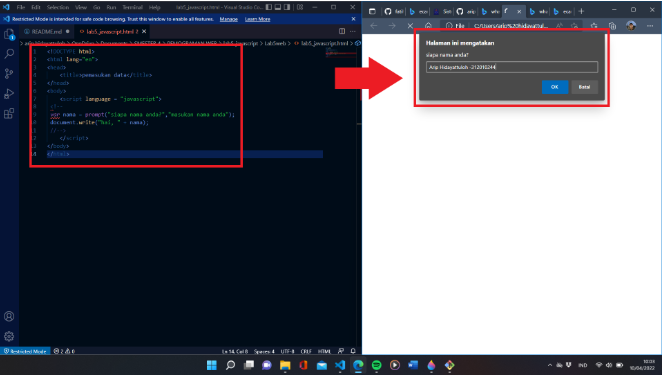
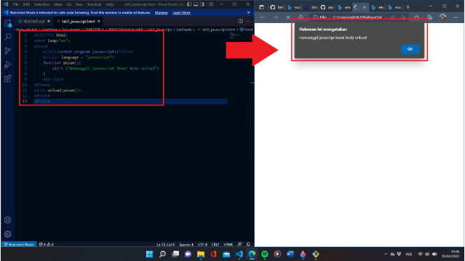
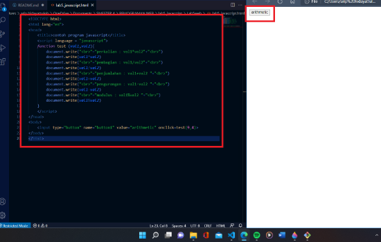
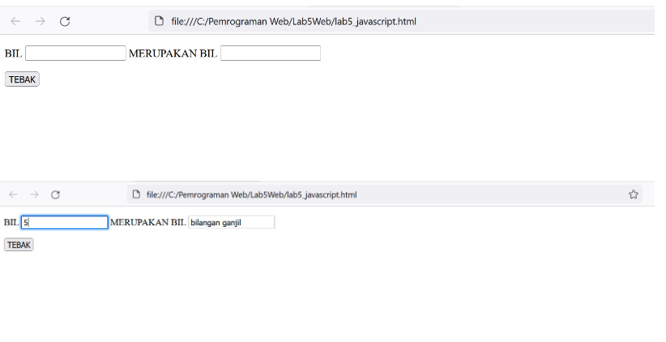
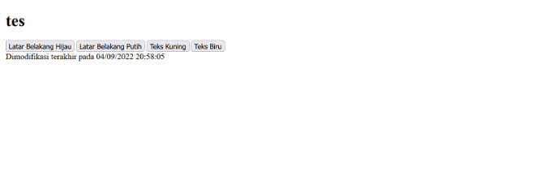

NAMA    : ADE PRASETIA 

KELAS   : TI 20 B1

NIM     : 312010208

Instruksi Praktikum
1. Persiapkan text editor misalnya VSCode.
2. Buat folder baru dengan nama lab5_javascript.
3. Ikuti langkah-langkah praktikum yang akan dijelaskan berikutnya.
4. Lakukan validasi dokumen html dengan mengakses http://validator.w3.org

Langkah-langkah Praktikum

Javascrip Dasar Pemakaian Alert sebagai property window.

Pemakaian method dalam objek

Pemakaian Prompt

Pembuatan fungsi dan cara pemanggilannya

Operasi dasar aritmatika

