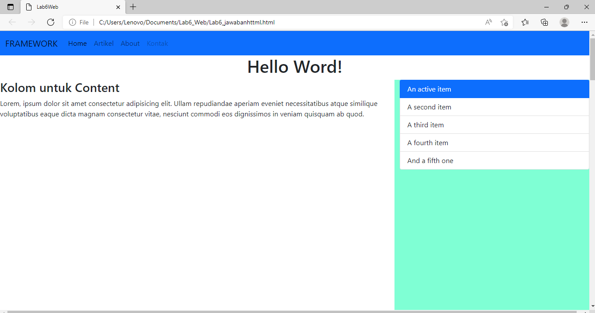

# Lab6_Web
Tugas pratikum 6

NAMA    : Ade prasetia  

KELAS   : Ti 20 B1 
NIM     : 312010208 

Saya akan menambahkan file **Lab6_jawabanhtml** dengan tampilam seperti berikut, 

MEMBUAT HEADER DAN HERO
pertama saya akan membuat halaman baru dengan nama index.html dimana didalam file tersebut sudah saya masukkan file Bootstrap dan Javascript yang ada.

 

 Membuat 2 kolom, 1 kolom Heading dan 1 kolom buat Widget Header

Disini saya akan membuat 2 kolom , kolom sisi kiri untuk Heading dan kolom sisi kanan untuk widget Header.

Selanjutnya, Pada bagian ini saya menambahkan article content masih di kolom kiri menambahkannya dibawah main content yg pertama tadi . Untuk source code nya seprti berikut.

Membuat widget menggunakan list group

Untuk selanjutnya saya akan membuat widget yang dibagian kolom sebelah kanan yg tadi diatas masih saya isi dengan text lorem. Disini saya menggunkan list group untuk membuatnya. Berikut source codenya.

Membuat Footer

Untuk membuat footer saya menggunakan grid dalam pembuatannya. Source code nya seperti berikut.

