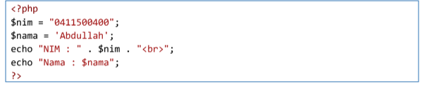

# Tugas-Pemrograman-Web

NAMA    : ADE  PRASETIA
KELAS   : TI 20 B1 
NIM     : 312010208

Menjalankan Web Server
Untuk menjalankan web server dari menu XAMPP Control.

Memulai PHP
Buat folder lab7_php_dasar pada root directory web server (d:\xampp\htdocs)

Kemudian untuk mengakses direktory tersebut pada web server dengan mengakses URL:
http://localhost/lab7_php_dasar/

**PHP Dasar**
Buat file baru dengan nama php_dasar.php pada directory tersebut. Kemudian buat
kode seperti berikut.

**Modul Praktikum Pemrograman Web**

Kemudian untuk mengakses hasilnya melalui URL:
http://localhost/lab7_php_dasar/php_dasar.php

Variable PHP
Menambahkan variable pada program.

**Predefine Variable $_GET**

Modul Praktikum Pemrograman Web

Untuk mengaksesnya gunakan URL:
http://localhost/lab7_php_dasar/latihan2.php?nama= ADE

**Membuat Form Input**

Modul Praktikum Pemrograman Web

Buatlah program PHP sederhana dengan menggunakan form input yang menampilkan
nama, tanggal lahir dan pekerjaan. Kemudian tampilkan outputnya dengan menghitung
umur berdasarkan inputan tanggal lahir. Dan pilihan pekerjaan dengan gaji yang
berbeda-beda sesuai pilihan pekerjaan.

