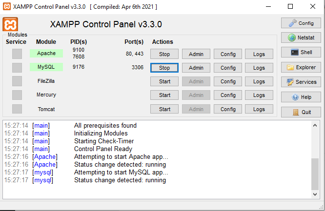
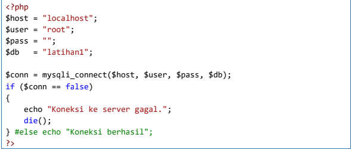

# Lab8_Web
Pratikum 8 Pertemuan 10

NAMA    : ADE PRASETIA

KLAS    : TI 20 B1

NIM     : 312010208

**Langkah-langkah Praktikum**
Persiapan
Untuk memulai membuat aplikasi CRUD sederhana, yang perlu disiapkan adalah
database server menggunakan MySQL. Pastikan MySQL Server sudah dapat dijalankan
melalui XAMPP.
Menjalankan MySQL Server
Untuk menjalankan MySQL Server dari menu XAMPP Contol.

**Mengakses MySQL Client menggunakan PHP MyAdmin**
Pastikan webserver Apache dan MySQL server sudah dijalankan. Kemudian buka
melalui browser: http://localhost/phpmyadmin/

**Membuat Tabel**

**Menambahkan Data**

**Membuat Program CRUD**
Buat folder lab8_php_database pada root directory web server (d:\xampp\htdocs)

**Kemudian untuk mengakses direktory tersebut pada web server** dengan mengakses URL:
http://localhost/lab8_php_database/

**Membuat file koneksi database**
Buat file baru dengan nama **koneksi.php**

**Membuat file index untuk menampilkan data (Read)**
Buat file baru dengan nama **index.php**

**Mengubah Data (Update)**
Buat file baru dengan nama **ubah.php**

**Menambah Data (Create)**
Buat file baru dengan nama **tambah.php**

**Menghapus Data (Delete)**
Buat file baru dengan nama **hapus.php**

