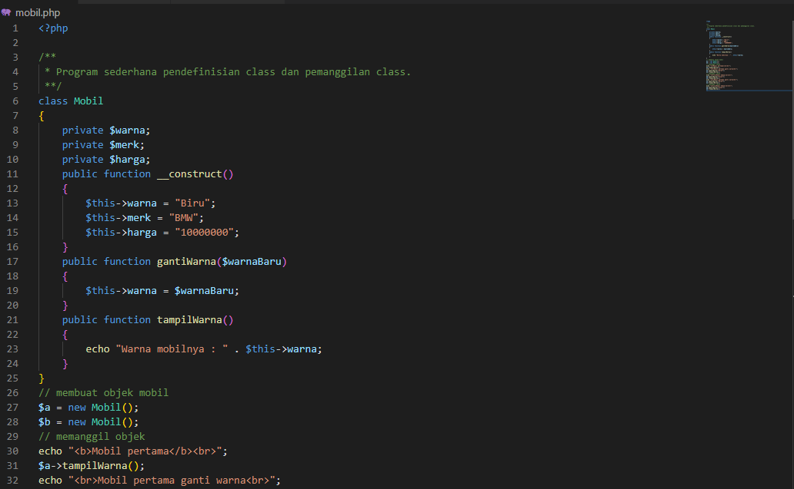
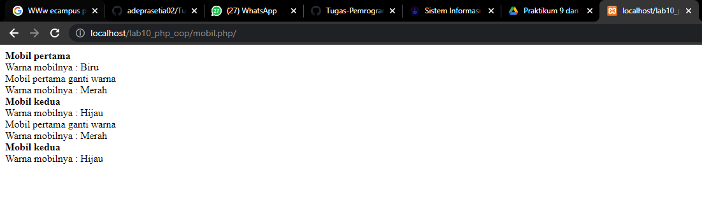
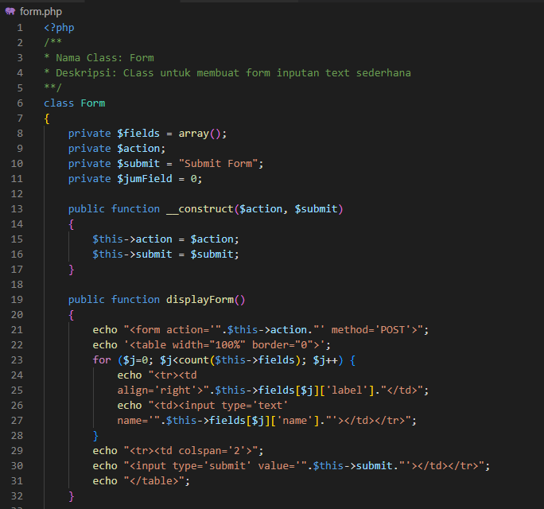
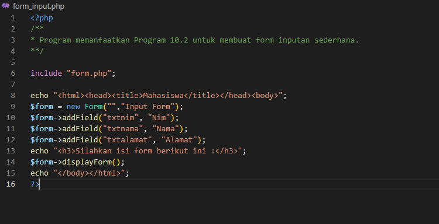
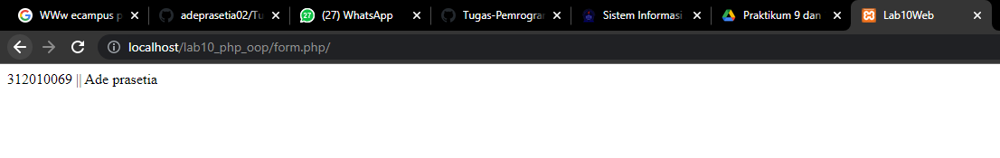
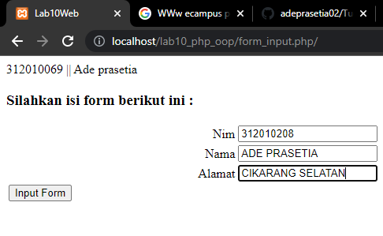

 

NAMA        : Ade prasetia
KELAS       : TI 20 B1
NIM         : 312010208 

Persiapan

Persiapkan text editor misalnya VSCode.

Buat folder baru dengan nama lab10_php_oop pada docroot webserver (htdocs)

membuat file baru dengan nama "mobil.php"

Lalu buat script seperti berikut.

Maka hasilnya akan seperti berikut.

2. Buat file baru dengan nama "form.php"

Lalu buat script seperti berikut.

3. Buat file baru dengan nama "form_input.php"

Lalu buat script seperti berikut.

Jika dilihat hasilnya akan seperti berikut.

Jika dilihat hasilnya akan seperti berikut.

